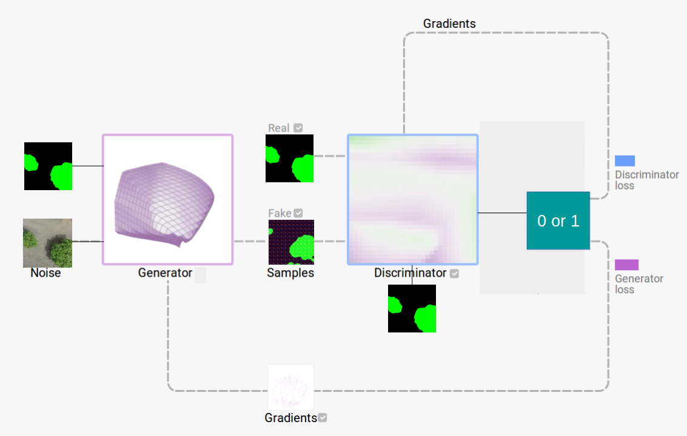

<h2 align="center">Tree Crown Extraction from Aerial Imagery using Conditional Generative Adversarial Network (cGAN)</h2>

<pre>
Pre-Requisites :
 - GPU     
 - Python3
 - Anaconda Distribution
 - TensorFlow
 - Keras
 </pre>
 
<pre>
<b>Specifications :</b>
<b>GPU</b> : Nvidia GeForce RTX 2080 Ti
<b>TensorFlow</b> : v2.0.0-beta
<b>Dataset</b> : Mangos Dataset
     Train Data : 5100 images
     Test Data : 1260 images
     Dataset Link : <a href="https://drive.google.com/open?id=1n4ol2nXdC_wbXe7JMO6HDOxMcvmy9JJH">https://drive.google.com/open?id=1n4ol2nXdC_wbXe7JMO6HDOxMcvmy9JJH</a>
     
<b>Dataset dimensions</b> :
     Train Data : 480 x 240 x 3
     Test Data : 480 x 240 x 3
<b></b>
</pre>

<pre>
<b>Architecture : </b>

</pre>

<pre>
<h5>References :</h5>
    1. Pix2Pix by TensorFlow authors. <a href="https://github.com/tensorflow/docs/blob/master/site/en/r2/tutorials/generative/pix2pix.ipynb">Link</a></pre>
    
